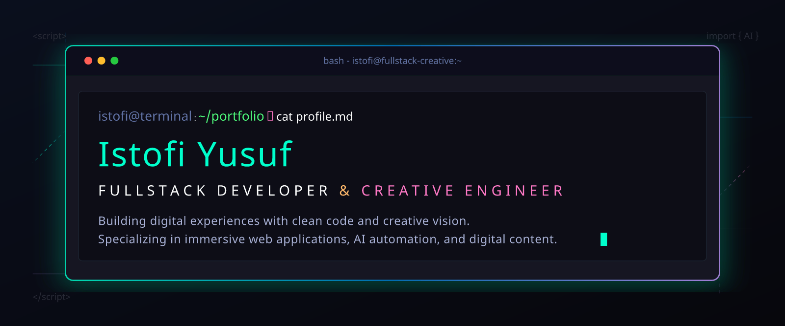

  <picture>
    <source media="(max-width: 760px) and (prefers-color-scheme: dark)" srcset="./assets/hero/agent-console-v5-mobile-dark.svg">
    <source media="(max-width: 760px)" srcset="./assets/hero/agent-console-v5-mobile-light.svg">
    <source media="(prefers-color-scheme: dark)" srcset="./assets/hero/agent-console-v5-dark.svg">
    <source media="(prefers-color-scheme: light)" srcset="./assets/hero/agent-console-v5-light.svg">
    
  </picture>

  
  
  

## About Me

I am **Istofi Yusuf**, a versatile developer and creator from Indonesia with expertise spanning **fullstack development, AI automation, UI/UX design, and DevOps**.

I build end-to-end digital products — from crafting beautiful interfaces with React & Tailwind, engineering robust backends with Node.js & Python, to deploying scalable infrastructure with Docker & AWS. I also bring a creative edge with motion graphics, video editing, and social media strategy.

My mission is to bridge the gap between **code, design, and business** to create impactful digital experiences.

## Current Focus

| Area | What I am exploring |
| --- | --- |
| **Fullstack Development** | React/Next.js + Node.js/Python end-to-end applications |
| **AI Integration** | OpenAI, LangChain, chatbot development, and prompt engineering |
| **Design Engineering** | UI/UX design systems, prototyping, and 3D web experiences |
| **DevOps** | Containerization, CI/CD pipelines, and cloud deployment |
| **Content Creation** | Video editing, motion graphics, and social media strategy |

## Featured Work

| Project | Focus | Why it matters |
| --- | --- | --- |
| [**ZENMOVIE**](https://github.com/istofiyusuf/zenmovie) | Anime & Donghua Streaming Platform | Full-stack streaming platform with multi-server video sources, user authentication, watchlist, watch history, and responsive design for all devices. |
| [**ShopVerse**](https://github.com/istofiyusuf/shopverse) | Fullstack E-Commerce | A modern digital marketplace with multi-payment gateway integration, product catalog, cart system, order tracking, and admin dashboard — optimized for performance and conversion. |
| [**Zenverse**](https://github.com/istofiyusuf/zenverse) | Android App Distribution | A free APK distribution platform with categorized downloads, search functionality, version tracking, and user reviews — built for speed and easy navigation. |

## Upcoming Projects

| Project | Focus | Why it matters |
| --- | --- | --- |
| **AI Flow Studio** | AI Automation Platform | A no-code AI automation platform with visual flow builder, custom AI agents, task scheduling, multi-step automation, and integrations with Slack, Discord, Gmail, and more. |
| **Pixel Forge** | Browser-based Design Tool | An online design platform combining traditional editing tools with AI capabilities — smart background removal, template library, team collaboration, and multi-format export. |
| **DevHub Dashboard** | Developer Tools | An all-in-one developer dashboard for project management, API testing, code snippets, and deployment monitoring. |

## Tech Stack

### Frontend

  
  
  
  
  
  
  
  
  

### Backend

  
  
  
  
  
  
  
  

### AI & Automation

  
  
  
  
  
  

### Design

  
  
  
  
  
  
  
  
  
  

### Social & Marketing

  
  
  
  
  
  
  
  

### DevOps & Tools

  
  
  
  
  
  
  
  
  
  
  
  

## Recent Activity

<!-- AUTO:ACTIVITY:START -->
- Aug 20, 2026: pushed 1 commit to [istofiyusuf/my-portofolio-v3](https://github.com/istofiyusuf/my-portofolio-v3).
<!-- AUTO:ACTIVITY:END -->

---

  Building at the intersection of code, design, and AI — one project at a time.

